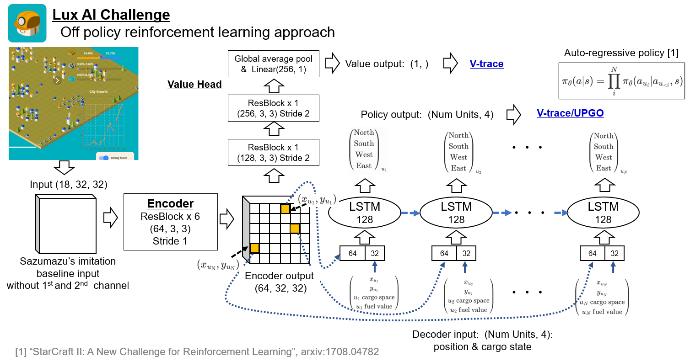

# lux ai competition 
Off policy reinforcement learning approach for Lux ai competition Kaggle
For the details of the competition, please check this page -> [Lux ai](https://www.kaggle.com/c/lux-ai-2021/overview)

# Overview
I tried a off policy reinforcement learning, V-trace/UPGO.
Training from random weight, the score of my agent is ~1200, but
 I think adding more training or other simple modification would improve the score.
Because remaining 1 or half day left when I confirmed the clear convergence of my rl algorithm...



* model: based on [image caption](https://arxiv.org/abs/1707.07998), task, encoder and lstm decoder architecture.
* multi agent action space: using auto regressive policy, [arxiv](https://arxiv.org/abs/1708.04782)

$$
\pi_{\theta}(a|s) = \prod_{i}^{N}\pi_{\theta}(a_{u_{i}}|a_{u_{<i}},s), \hspace{0.5cm} s:{\rm state},\  \ a_{u_{i}}: {\rm unit_i\ action}
$$

* Extending handyrl : Extending [handyrl](https://github.com/DeNA/HandyRL) to multi agent policy from single agent policy.
Specifically all tensors are replaced like this, (episodes, steps, players, actions) -> (episodes, steps, players, units, actions) and loss is modified for auto regressive style.

* Decoder input: 
    * making unique unit order: beginning from min y unit and then find the nearest neighbor unit repeatedly.
    * (x, y, cargo_space, fuel) for each unit. This 4 dim is converted into 32 dim through a linear layer.
    * unlike image cation model, we know the exact place of each unit that's why I directly use the unit position"s feature of the encoder, instead of the pooled feature.
* UPGO is much faster for convergence than V-trace.
* Reward: use intermediate reward, borrow from glmcdona's implementation and reduce unit part by 1/2 or 1/4.
* kaggle notebook: [here](https://www.kaggle.com/sai11fkaneko/lux-ai-off-policy), you can check my agent of 1035 epoch(500,000 episodes).

This is my first reinforcement learning project and there might be some misunderstandings. Please be free to ask me if you find something weird.

# How to run
This is a code for a kaggle competition and some part is not so clean right now.
I will fix such a part little by little.

## environment
* Ubuntu 18.04
* Python with Anaconda/Mamba
* NVIDIA GPUx1

## Code&Package Installation
```bash
# clone project
$PROJECT=kaggle_lux_ai
$CONDA_NAME=lux_ai
git clone https://github.com/Fkaneko/$PROJECT

# install project
cd $PROJECT
conda create -n $CONDA_NAME python=3.7
conda activate $CONDA_NAME
yes | bash install.sh
 ```
## Training
Simply run followings
```python
python handyrl_main.py -t   # for reinforcement learning from random weight
```
Please check the `src/config/handyrl_config.yaml` for the default training configuration.
Also need to check the original [handyrl documentation](https://github.com/DeNA/HandyRL).

## Testing
You can check your agent on a kaggle env like [this one](https://www.kaggle.com/sai11fkaneko/lux-ai-off-policy).
After training you will find the checkpoint under `./models`. 
<!-- ```python -->
<!-- python test_agents.py -->
<!-- ``` -->
<!-- Testing enviroment is done with gym env - stable baseline agent class. -->
<!-- Please check these class for run match. -->


# License
## Dependent repositories
There are forked repositories inside this repository. Please also check [NOTICE](./NOTICE)
* LuxPythonEnvGym: MIT, https://github.com/glmcdona/LuxPythonEnvGym
* HandyRL:MIT, https://github.com/DeNA/HandyRL

##  Code
MIT
